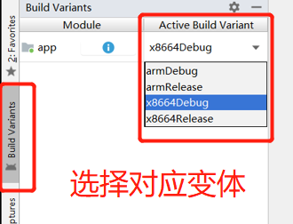

# dps_player_demo_flavor
## 海豚星空投屏 接收端 demo 变体版
## 供学习参考

## 1,下载依赖

```bash
#强制刷新依赖 在应用根目录下执行,确保变体依赖完全下载
gradlew build --refresh-dependencies
```
## 2, 开发
查看[开发者文档](https://dolphinstar.cn/doc/receive_android/integrate.html)

## 3，选择变体
